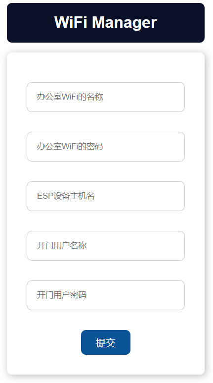
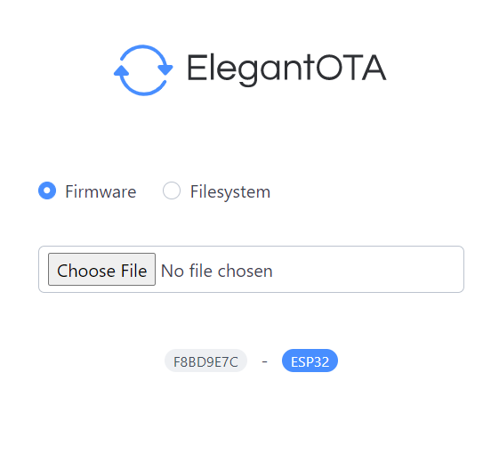

# Door-lock-system

This NFC door lock system uses ESP32 and 28BYJ-48 stepper motors.

## 1. Add a new card
You can use `RFID_READ.ino` file to read a new card, the formate should be like this `{0xF1, 0x41, 0x01, 0x5F}`.

Then add new card to `RFID.ino` file.

```cpp
const uint8_t UID[][4] = {
    {0xF1, 0x41, 0x01, 0x5F}, {0x01, 0x5E, 0x95, 0x2B}, {0x1A, 0xFD, 0xA5, 0x21},
    {0xD1, 0x7E, 0xFF, 0x5E}, {0x21, 0xDE, 0x01, 0x5F}, {0xD1, 0x3A, 0xF6, 0x5E},
    {0x0A, 0x57, 0x80, 0x1C}, {0xFA, 0x5D, 0x70, 0x7F}, {0xD2, 0xAA, 0x1C, 0x3E},
};
```

## 2. Access RFID

In order to make this system more efficent, I add a sensor to interrupt MCU. So you may need to touch the sensor first.

Besides RFID card access, you can also use web UI by [http://unlockdoor-507](http://unlockdoor-507) if you connect the same router.

You need to login in first, the default username is `admin`, default password is `dinghao666`.

Login page


Web UI page


## 3. Change configurations

You can hold boot button on ESP32 for 2 seconds, and you will enter into WiFi manager mode where you can change some basic settings for your device.

After you press button for 2 seconds, ESP32 will enter ino AP mode, and generated an `Access Point` whose ssid is `WiFi Manger` and the password is `123456789` and the default gateway is [http://192.168.4.1](http://192.168.4.1)



## 4. Upload bin through Web

You can also upload bin file directly by web page on [https://unlockdoor-507/upload](https://unlockdoor-507/upload).



Happy Hacking!