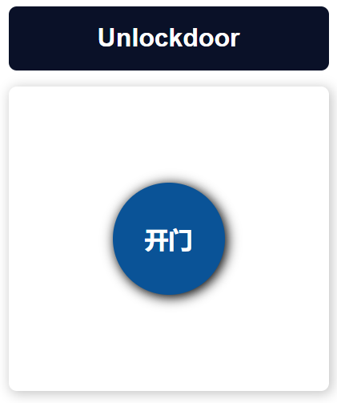

# Door-lock-system

This NFC door lock system uses ESP32 and 28BYJ-48 stepper motors.

## 1. Add a new card

You can use `RFID_READ.ino` file to read a new card, the formate should be like this `{0xF1, 0x41, 0x01, 0x5F}`.

Then add new card to `RFID.ino` file.

```cpp
const uint8_t UID[][4] = {
    {0xF1, 0x41, 0x01, 0x5F},
};
```

## 2. Access RFID

In order to make this system more efficent, I add a sensor to interrupt MCU. So you may need to touch the sensor first.

Besides RFID card access, you can also use web UI by [http://unlockdoor-507](http://unlockdoor-507) if you connect the same router.

You need to login in first, the default username is `admin`, default password is `stas`.

Login page


Home page


